```mermaid
graph TD
    A[🔒 Security & Quality] --> B[📊 Data Processing]
    B --> C[🤖 Model Training]
    C --> D[🐳 Build & Publish]
    
    A --> A1[Dependency Scanning]
    A --> A2[Code Security Analysis]
    A --> A3[Quality Checks]
    A --> A4[Unit Tests]
    
    B --> B1[Data Cleaning]
    B --> B2[Feature Engineering]
    B --> B3[Data Validation]
    
    C --> C1[MLflow Setup]
    C --> C2[Model Training]
    C --> C3[Performance Testing]
    C --> C4[Drift Detection]
    
    D --> D1[Container Build]
    D --> D2[Security Scanning]
    D --> D3[Integration Tests]
    D --> D4[DockerHub Push]
```

```mermaid
graph TD
    A[🔒 Security & Quality] --> B[🐳 Build & Deploy]
    
    A --> A1[Streamlit Dependencies]
    A --> A2[Security Scanning]
    A --> A3[Code Quality]
    A --> A4[App Validation]
    
    B --> B1[Version Tagging]
    B --> B2[Container Build]
    B --> B3[Security Scan]
    B --> B4[Integration Tests]
    B --> B5[Performance Tests]
```

# 🚀 MLOps CI/CD Workflows Documentation

This directory contains enterprise-grade GitHub Actions workflows that implement a complete MLOps pipeline for the House Price Predictor project. These workflows demonstrate modern best practices for machine learning operations, including security scanning, automated testing, and containerized deployments.

## 📋 Overview

Our MLOps architecture consists of two complementary workflows:

1. **🏗️ MLOps Pipeline** (`mlops-pipeline.yaml`) - Complete ML lifecycle automation
2. **🎨 Streamlit CI** (`model-ci.yaml`) - Frontend application deployment

Both workflows follow enterprise security standards and implement comprehensive testing strategies.

---

## 🏗️ MLOps Pipeline (`mlops-pipeline.yaml`)

### Purpose
The main MLOps pipeline orchestrates the complete machine learning lifecycle from data processing to model deployment. It ensures quality, security, and reproducibility at every step.

### Architecture Overview



### Triggers
- **Push to main branch**: Full pipeline execution
- **Git tags** (`v*.*.*`): Versioned releases
- **Pull requests**: Validation pipeline

### Jobs Breakdown

#### 1. 🔒 Security & Quality
**Purpose**: Ensures code quality and security before any processing begins.

**Steps**:
- **Dependency Scanning**: Uses `safety` to check for known vulnerabilities
- **Code Security Analysis**: `bandit` scans for security issues in Python code
- **Code Quality**: `flake8` linting and `mypy` type checking
- **Unit Tests**: `pytest` with coverage reporting
- **Artifact Storage**: Security reports saved for review

**Technologies**: `safety`, `bandit`, `flake8`, `mypy`, `pytest`

#### 2. 📊 Data Processing
**Purpose**: Transforms raw data into ML-ready features with validation.

**Steps**:
- **Data Cleaning**: Processes raw house data (`house_data.csv`)
- **Feature Engineering**: Creates enhanced features for model training
- **Data Validation**: Ensures output files exist and contain data
- **Artifact Upload**: Processed data and preprocessors saved

**Dependencies**: Requires security checks to pass
**Output**: `featured_house_data.csv`, `preprocessor.pkl`

#### 3. 🤖 Model Training
**Purpose**: Trains ML models with experiment tracking and validation.

**Steps**:
- **MLflow Setup**: Containerized experiment tracking server
- **Configuration Validation**: Ensures model config exists
- **Model Training**: Executes training with MLflow logging
- **Performance Testing**: Validates model files and performance
- **Drift Detection**: Statistical analysis for data quality issues
- **Model Validation**: Ensures training outputs are valid

**Technologies**: `MLflow`, `scikit-learn`, `Docker`
**Dependencies**: Requires data processing to complete
**Output**: Trained model artifacts

#### 4. 🐳 Build & Publish
**Purpose**: Containerizes the model API and deploys to registry.

**Steps**:
- **Artifact Collection**: Downloads models and preprocessors
- **Version Generation**: Smart tagging based on git refs
- **Container Build**: Multi-platform Docker image creation
- **Security Scanning**: `Anchore` container vulnerability assessment
- **Integration Testing**: End-to-end API validation
- **Registry Push**: DockerHub deployment with proper tags

**Technologies**: `Docker Buildx`, `Anchore`, `DockerHub`
**Dependencies**: Requires model training to complete
**Output**: `house-price-model` container images

### Version Strategy

| Trigger Type | Tag Format | Example |
|--------------|------------|---------|
| Git Tag | `v{tag}`, `latest` | `v1.2.3`, `latest` |
| Main Branch | `main-{sha}`, `latest` | `main-a1b2c3d4`, `latest` |
| Feature Branch | `{branch}-{sha}`, `latest` | `feature-auth-x9y8z7w6`, `latest` |

### Environment Variables

```yaml
env:
  PYTHON_VERSION: '3.10'    # Consistent Python version
  REGISTRY: docker.io       # Container registry
```

### Required Secrets & Variables

**Repository Variables**:
- `DOCKERHUB_USERNAME`: Your DockerHub username

**Repository Secrets**:
- `DOCKERHUB_TOKEN`: DockerHub access token

---

## 🎨 Streamlit CI (`model-ci.yaml`)

### Purpose
Dedicated CI/CD pipeline for the Streamlit frontend application, enabling independent deployments and frontend-specific testing.

### Architecture Overview



### Triggers
- **Push to `streamlit_app/**`**: Only when frontend changes
- **Git tags** (`v*.*.*`): Versioned releases
- **Pull requests** affecting `streamlit_app/`: Validation
- **Manual dispatch**: On-demand deployment

### Jobs Breakdown

#### 1. 🔒 Security & Quality
**Purpose**: Streamlit-specific security and quality validation.

**Steps**:
- **Dependency Installation**: Streamlit and testing tools
- **Vulnerability Scanning**: `safety` check on Streamlit dependencies
- **Security Analysis**: `bandit` scan of Streamlit code
- **Code Quality**: Linting and type checking
- **Structure Validation**: Ensures required files exist
- **Report Upload**: Security findings preserved

**Focus Areas**: Frontend-specific security concerns

#### 2. 🐳 Build & Deploy
**Purpose**: Containerizes and deploys the Streamlit application.

**Steps**:
- **Smart Versioning**: Consistent with main pipeline
- **Multi-platform Build**: ARM64 and AMD64 support  
- **Container Scanning**: Security validation of built images
- **Integration Testing**: 
  - Health endpoint validation
  - Page loading verification
  - Container startup verification
- **Performance Testing**:
  - Memory usage monitoring
  - Response time validation
  - Resource consumption analysis

**Technologies**: `Docker Buildx`, `Anchore`, `Streamlit`

### Performance Benchmarks

| Metric | Threshold | Purpose |
|--------|-----------|---------|
| Response Time | < 5 seconds | User experience validation |
| Memory Usage | Monitored | Resource optimization |
| Startup Time | < 30 seconds | Deployment validation |

---

## 🔧 Workflow Features

### Security-First Approach
- **Multi-layer scanning**: Dependencies, code, and containers
- **Fail-fast validation**: Stop pipeline on security issues
- **Comprehensive reporting**: All findings preserved as artifacts

### Quality Assurance
- **Automated testing**: Unit, integration, and performance tests
- **Code quality**: Linting, type checking, and best practices
- **Validation gates**: Prevent bad code from reaching production

### Production Readiness
- **Multi-platform support**: AMD64 and ARM64 architectures
- **Smart caching**: GitHub Actions and Docker layer caching
- **Rollback capability**: Version tags enable easy rollbacks
- **Monitoring**: Performance and resource tracking

### DevOps Best Practices
- **Infrastructure as Code**: All configurations in version control
- **Reproducible builds**: Consistent environments and dependencies
- **Artifact management**: Proper versioning and storage
- **Observability**: Comprehensive logging and reporting

---

## 🚀 Usage Guide

### Prerequisites

1. **GitHub Repository Setup**:
   ```bash
   # Repository variables (Settings → Secrets and variables → Actions → Variables)
   DOCKERHUB_USERNAME=your-dockerhub-username
   
   # Repository secrets (Settings → Secrets and variables → Actions → Secrets)  
   DOCKERHUB_TOKEN=your-dockerhub-access-token
   ```

2. **DockerHub Access Token**:
   - Go to DockerHub → Account Settings → Security
   - Create new access token with Read/Write permissions
   - Add token to GitHub secrets as `DOCKERHUB_TOKEN`

### Triggering Workflows

#### Automatic Triggers
```bash
# Trigger MLOps Pipeline
git add .
git commit -m "Update ML model"
git push origin main

# Trigger Streamlit CI (only affects frontend)
git add streamlit_app/
git commit -m "Update UI design"  
git push origin main

# Trigger both with versioned release
git tag v1.2.3
git push origin v1.2.3
```

#### Manual Triggers
- Go to **Actions** tab in GitHub
- Select desired workflow
- Click **Run workflow**
- Choose branch and click **Run workflow**

### Monitoring Workflows

#### Success Indicators
- ✅ All jobs complete successfully
- ✅ Security scans pass without high-severity issues
- ✅ All tests pass
- ✅ Images pushed to DockerHub
- ✅ Integration tests validate functionality

#### Troubleshooting Common Issues

**Security Scan Failures**:
```bash
# Check security reports artifacts
# Update dependencies if vulnerabilities found
pip install --upgrade package-name
```

**Docker Build Failures**:
```bash
# Verify Dockerfile syntax
# Check context path and file locations
# Ensure all required files exist
```

**Integration Test Failures**:
```bash
# Check container logs in workflow output
# Verify API endpoints and health checks
# Ensure proper network connectivity
```

### Artifact Management

Each workflow produces artifacts available for download:

| Workflow | Artifacts | Purpose |
|----------|-----------|---------|
| MLOps Pipeline | `security-reports` | Security scan results |
| | `container-scan-results` | Container vulnerability reports |
| Streamlit CI | `streamlit-security-reports` | Frontend security scans |
| | `streamlit-container-scan-results` | Frontend container scans |

---

## 🏆 Best Practices

### Development Workflow
1. **Feature Development**: Work on feature branches
2. **Pull Request**: Create PR for code review
3. **Validation**: Workflows run on PR for validation
4. **Merge**: Merge to main triggers full deployment
5. **Release**: Tag for versioned production releases

### Security Practices
- **Regular Updates**: Keep dependencies updated
- **Review Reports**: Check security artifacts regularly
- **Access Control**: Use minimal required permissions
- **Secrets Management**: Never commit secrets to code

### Performance Optimization
- **Cache Utilization**: Workflows use pip and Docker caching
- **Parallel Jobs**: Security runs independently where possible
- **Resource Management**: Proper cleanup prevents resource leaks
- **Monitoring**: Track build times and resource usage

### Maintenance
- **Action Updates**: Keep GitHub Actions up to date
- **Dependency Management**: Regular dependency audits
- **Documentation**: Keep workflow docs synchronized
- **Testing**: Validate workflow changes in feature branches

---

## 📊 Metrics & Monitoring

### Pipeline Metrics
- **Build Success Rate**: Target >95%
- **Average Build Time**: Monitor for performance degradation
- **Security Issues**: Track and remediate findings
- **Test Coverage**: Maintain >80% coverage

### Container Metrics
- **Image Size**: Monitor for bloat
- **Vulnerability Count**: Track security posture
- **Performance**: Response times and resource usage
- **Deployment Success**: Monitor registry push success

---

## 🔗 Integration Points

### External Services
- **DockerHub**: Container registry for deployment
- **MLflow**: Experiment tracking and model registry
- **GitHub Actions**: CI/CD orchestration
- **Anchore**: Container security scanning

### Project Structure Dependencies
```
├── src/models/train_model.py     # Model training script
├── model_app/Dockerfile          # FastAPI container definition
├── streamlit_app/Dockerfile      # Streamlit container definition
├── configs/model_config.yaml     # Model configuration
├── data/raw/house_data.csv       # Training data
└── requirements.txt              # Python dependencies
```

---

## 🆘 Support & Troubleshooting

### Common Issues

1. **"No model files found" Error**:
   - Ensure `configs/model_config.yaml` exists
   - Check model training script execution
   - Verify MLflow connectivity

2. **Docker Build Context Issues**:
   - Verify Dockerfile location matches workflow
   - Check file paths in COPY instructions
   - Ensure required files exist in context

3. **Permission Errors**:
   - Verify DockerHub credentials
   - Check repository access permissions
   - Ensure secrets are properly configured

### Getting Help
- **Workflow Logs**: Check GitHub Actions tab for detailed logs
- **Artifacts**: Download and review security reports
- **Issues**: Create GitHub issues for persistent problems
- **Documentation**: Refer to this README for configuration details

---

## 🎓 Learning Resources

### MLOps Concepts
- [MLOps Principles](https://ml-ops.org/content/mlops-principles)
- [CI/CD for Machine Learning](https://neptune.ai/blog/ci-cd-for-machine-learning)
- [Container Security Best Practices](https://sysdig.com/blog/container-security-best-practices/)

### GitHub Actions
- [GitHub Actions Documentation](https://docs.github.com/en/actions)
- [Workflow Syntax](https://docs.github.com/en/actions/reference/workflow-syntax-for-github-actions)
- [Docker Build Push Action](https://github.com/docker/build-push-action)

### Security Tools
- [Safety Documentation](https://pypi.org/project/safety/)
- [Bandit Security Linter](https://bandit.readthedocs.io/)
- [Anchore Container Scanning](https://anchore.com/opensource/)

---

*This documentation is part of the House Price Predictor MLOps project. For more information, see the main project [README](../../README.md).*